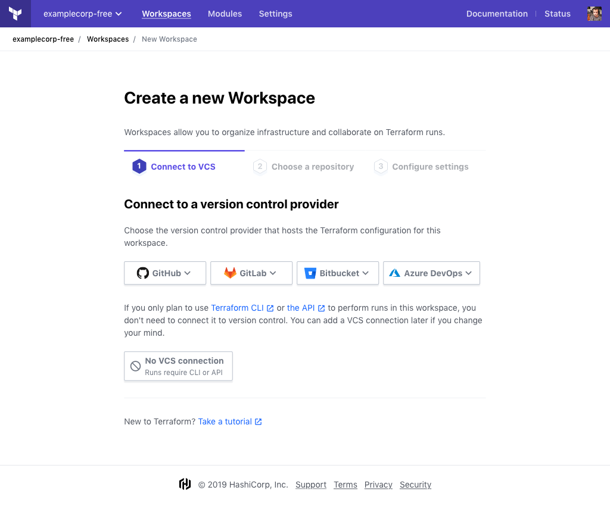
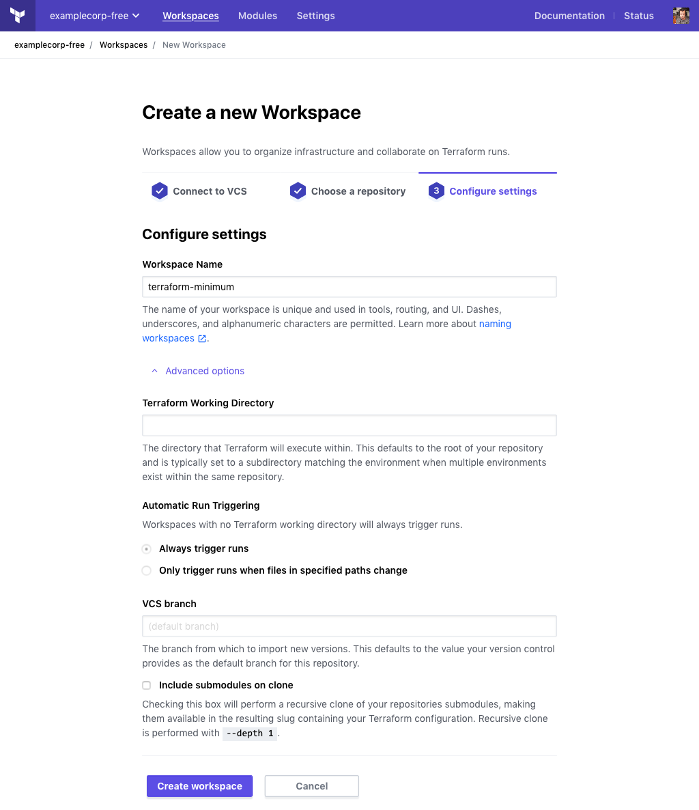
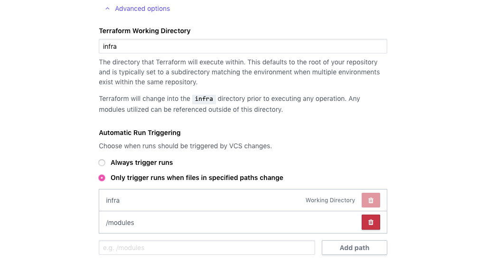

# Creating Workspaces

-> **API:** See the [Create a Workspace endpoint](../api/workspaces.html#create-a-workspace) (`POST /organizations/:organization/workspaces`).  
**Terraform:** See the `tfe` provider's [`tfe_workspace` resource](/docs/providers/tfe/r/workspace.html).

Workspaces are how Terraform Cloud organizes infrastructure. You'll create new workspaces whenever you need to manage a new collection of infrastructure resources.

## Required Permissions

New workspaces can be created by:

- [The owners team](../users-teams-organizations/teams.html#the-owners-team).
- Teams that have the [manage workspaces](../users-teams-organizations/permissions.html#manage-workspaces) permission.

## Configuring a New Workspace

To start creating a new workspace, use the "+ New Workspace" button, which appears above the list of workspaces. You can navigate to the workspace list with the "Workspaces" button in the top navigation bar.

Next, on the "Create a New Workspace" page, configure the workspace's basic settings. Every workspace needs a unique name, and needs to specify where its Terraform configuration comes from (usually a VCS repository).

The workspace creation UI is split into multiple screens, so that it can skip options that aren't relevant to your current choices.

All of the settings on these screens can be changed later if necessary.

### Version Control Settings

In order to perform remote Terraform runs, a workspace needs a Terraform configuration. This configuration generally changes over time, so Terraform Cloud expects a workspace to receive a series of _configuration versions._

There are two ways to provide configuration versions to workspaces:

- **Recommended:** Connect the workspace to a version control repository. The workspace automatically performs a run when the configuration changes, and performs speculative plans to help you review pull requests. See [VCS-driven Runs](../run/ui.html) for more details.
- Push updated configurations manually, using either Terraform CLI (with the remote backend configured) or the Terraform Cloud API. See [CLI-driven Runs](../run/cli.html) and [API-driven Runs](../run/api.html) for more details.

Most of the controls in the "Create a New Workspace" page are devoted to selecting a version control repository.

The only things Terraform Cloud needs to begin with
 The workspace creation page doesn't include all of the available workspace settings  At minimum, you need to provide a unique name Terraform Cloud needs to know where this Terraform configuration will come from

To finish creating the workspace, you'll need to specify where its Terraform configuration will come from and choose a unique name.

In the workspace creation page,

To create a new workspace, you need to choose

NEW FLOW:

- pick provider, or none
    - different interface depending on if you connected vcs yet
        - but you can also bring back old dropdown buttons with "connect to different vcs"
        - dropdown buttons mostly take you away from page, except gh simple
- choose repo
- change name if desired, set other settings

------

- Where the workspace's configuration should come from.

 to know where the workspace's configuration comes from.

Workspace creation is split into

You must fill out several fields to configure your new workspace:

- **Workspace name** (required) — A name for the workspace, which must be unique in the organization. Names can include letters, numbers, `_`, and `-`. [See more advice about workspace names here](./naming.html).
- **Source** (required; list of buttons) — Which [connected VCS provider](../vcs/index.html) the workspace should pull configurations from. If you've configured multiple VCS providers, there is a button for each of them.

  If you select "None," the workspace cannot pull configurations automatically, but you can upload configurations with [the remote backend](../run/cli.html) or [the run API](../run/api.html).

- **Repository** — The VCS repository that contains the Terraform configuration for this workspace. This field is hidden when creating a workspace without a VCS source.

  Repository identifiers are determined by your VCS provider, and use a format like `<ORGANIZATION>/<REPO NAME>` or `<PROJECT KEY>/<REPO NAME>`.

  This field supports autocompletion of your most recently used repositories. If you need to specify a repository that isn't included in the autocomplete list, you can enter the full name manually.

  If necessary, you can change a workspace's VCS repository after creating it.

VCS-backed workspaces support several optional fields, which you can reveal by clicking the "More options" link. These fields are hidden when creating a workspace without a VCS source.

- **Terraform working directory** — The directory where Terraform will execute, specified as a relative path from the root of the repo. This is useful when working with VCS repos that contain multiple Terraform configurations. Defaults to the root of the repo.

- **Automatic run triggering** — If you specify a working directory, Terraform Cloud will by default only queue a plan for changes to the repository inside that working directory. You can override this behavior with these settings. See [Automatic Run Triggering](../workspaces/settings.html#automatic-run-triggering) settings for more details.

- **VCS branch** — Which branch of the repository to use. If left blank, Terraform Cloud will use the repository's default branch.
- **Include submodules on clone** (checkbox) — Whether to recursively clone all of the repository's Git submodules when fetching a configuration.

  -> **Note:** The [SSH key for cloning Git submodules](../vcs/index.html#ssh-keys) is set in the VCS provider settings for the organization, and is not necessarily related to the SSH key set in the workspace's settings.

## After Creating a Workspace

When you create a new workspace, a few things happen:

- Terraform Cloud _doesn't_ immediately queue a plan for the workspace. Instead, it presents a dialog with shortcut links to either queue a plan or edit variables. If you don't need to edit variables, manually queuing a plan confirms that the workspace is ready to run.
- If you selected a VCS provider and repository, Terraform Cloud automatically registers a webhook. The next time new commits appear in the selected branch of that repo or a PR is opened to that branch, Terraform Cloud will automatically queue a Terraform plan for the workspace. More at [VCS Connection webhooks](../vcs/index.html#webhooks).

A workspace with no runs will not accept new runs via VCS webhook; at least one run must be manually queued to confirm that the workspace is ready for further runs.

Most of the time, you'll want to do one or more of the following after creating a workspace:

- [Edit variables](./variables.html)
- [Edit workspace settings](./settings.html)
- [Work with runs](../run/index.html)
