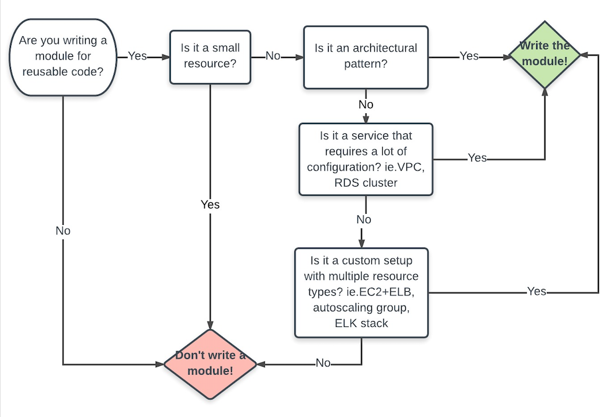

# Part 3: Transitioning From Current State to Desired End State

## Introduction

This section describes the steps necessary to move an organization from manual provisioning processes to a collaborative infrastructure as code workflow.

In this section we will go through each stage of maturity and list the steps necessary for an organization to move on to the next stage of maturity.

## 3.1 Moving from Manual Changes to Semi-Automated

Building infrastructure manually (with CLI or GUI tools) results in infrastructure that is hard to audit, hard to reproduce, hard to scale, and hard to share knowledge about.

If your current provisioning practices are largely manual, your first goal is to begin using open source Terraform in a small, manageable subset of your infrastructure. Once you’ve gotten some small success using Terraform, you’ll have reached the semi-automated stage of provisioning maturity, and can begin to scale up and expand your Terraform usage.

Allow one individual (or a small group) in your engineering team to get familiar with Terraform by following these steps:

1. [Install Terraform OSS](https://www.terraform.io/intro/getting-started/install.html).
2. Write your first [Terraform Configuration file](https://www.terraform.io/intro/getting-started/build.html).
3. Follow the rest of the [Terraform getting started guide](https://www.terraform.io/intro/getting-started/change.html). These pages will walk you through [changing](https://www.terraform.io/intro/getting-started/change.html) and [destroying](https://www.terraform.io/intro/getting-started/destroy.html) resources, working with [resource dependencies](https://www.terraform.io/intro/getting-started/dependencies.html), and more.
4. Choose a small real-life project and implement it with Terraform. Look at your organization’s list of upcoming projects, and designate one to be a Terraform proof-of-concept. Alternately, you can choose some existing infrastructure to re-implement with Terraform.

    The key is to choose a project with limited scope and clear boundaries, such as provisioning infrastructure for a new application on AWS. This helps keep your team from getting overwhelmed with features and possibilities. You can also look at some [example projects](https://github.com/hashicorp/terraform/tree/master/examples/) to get a feel for your options. (The [AWS two-tier example](https://github.com/terraform-providers/terraform-provider-aws/tree/master/examples/two-tier) is often a good start.)

    Your goal here is to build a small but reliable core of expertise with Terraform, and demonstrate its benefits to others in the organization.

At this point, you’ve reached a semi-automated stage of provisioning practices — one or more people in the organization can write Terraform code to provision and modify resources, and a small but meaningful subset of your infrastructure is being managed as code. This is a good time to provide a small demo to the rest of team to show how easy it is to write and provision infrastructure with Terraform.

## 3.2 Moving from Semi-Automated to Infrastructure as Code

We define semi-automated provisioning as a mix of at least two of the following practices:

* Infrastructure as code with Terraform.
* Manual CLI or GUI processes.
* Scripts.

If that describes your current provisioning practices, your next goal is to expand your use of Terraform, reduce your use of manual processes and imperative scripts, and make sure you’ve adopted the foundational practices that make infrastructure as code more consistent and useful.

Note: If you aren’t already using infrastructure as code for some portion of your infrastructure, make sure you follow the steps in the previous section first.

5. Choose and implement a version control system (VCS) if your organization doesn’t already use a VCS.
    You might be able to get by with a minimalist Git/Mercurial/SVN server, but we recommend adopting a more robust collaborative VCS application that supports code reviews/approvals and has APIs for accessing data and administering repositories and accounts. Bitbucket, GitLab, and GitHub are popular tools in this space.

    If you already have established VCS workflows, layouts, and access control practices, great! If not, this is a good time to make these decisions. (We consider [this advice](https://www.drupalwatchdog.com/volume-4/issue-2/version-control-workflow-strategies) to be a good starting point.) Make sure you have a plan for who is allowed to merge changes and under what circumstances — since this code will be managing your whole infrastructure, it’s important to maintain its integrity and quality.

    Also, make sure to write down your organization’s expectations and socialize them widely among your teams.

6. Create a repo that Terraform Enterprise will be able to access.Currently, Terraform Enterprise supports integrations with GitHub, GitLab and Atlassian Bitbucket (both Server and Cloud).

7. Start moving infrastructure code into version control. New Terraform code should all be going into version control; if you have existing Terraform code that’s outside version control, start moving it in so that everyone in your organization knows where to look for things and can track the history and purpose of changes.

8. Create your first module. [Terraform](https://www.terraform.io/docs/modules/usage.html) [modules](https://www.terraform.io/docs/modules/usage.html) are reusable configuration units. They let you manage pieces of infrastructure as a single package you can call and define multiple times in the main configuration for a workspace. Examples of a good Terraform module candidate would be an auto-scaling group on AWS that wraps a launch configuration, auto-scaling group, and EC2 Elastic Load Balancer (ELB).. If you are already using Terraform modules, make sure you’re following the best practices and keep an eye on places where your modules could improve.

    The diagram below can help you decide when to write a module:

    

9. Spread Terraform skills to additional teams, and improve the skills of existing infrastructure teams. In addition to internal training and self-directed learning, you might want to consider:

    * Sign your teams up for [official HashiCorp Training](https://www.hashicorp.com/training/) .
    * Make available resources such as [Terraform Up and Running: Writing Infrastructure as Code](https://www.amazon.com/Terraform-Running-Writing-Infrastructure-Code-ebook/dp/B06XKHGJHP/ref=sr_1_1?ie=UTF8&qid=1496138592&sr=8-1&keywords=terraform+up+and+running) or [Getting Started with Terraform](https://www.amazon.com/Getting-Started-Terraform-Kirill-Shirinkin/dp/1786465108/ref=sr_1_1?ie=UTF8&qid=1496138892&sr=8-1&keywords=Getting+Started+with+Terraform). These are especially valuable when nobody in your organization has used Terraform before.

10. Create standard build architectures to use as guidelines for writing Terraform code. Modules work best when they’re shared across an organization, and sharing is more effective if everyone has similar expectations around how to design infrastructure.
    Your IT architects should design some standardized build architectures specific to your organizational needs, to encourage building with high availability, elasticity and disaster recovery in mind, and to support consistency across teams.

    Here are a few examples of good build patterns, from several cloud providers:

    * AWS: [Well Architected Frameworks](https://d0.awsstatic.com/whitepapers/architecture/AWS_Well-Architected_Framework.pdf) and the [Architecture Center](https://aws.amazon.com/architecture/).
    * Azure: [deploying Azure Reference Architectures](https://github.com/mspnp/reference-architectures) and [Azure Architecture Center](https://docs.microsoft.com/en-us/azure/architecture/).
    * GCP: [Building scalable and resilient web applications.](https://cloud.google.com/solutions/scalable-and-resilient-apps)
    * Oracle Public Cloud: [Best Practices for Using Oracle Cloud.](https://docs.oracle.com/cloud/latest/stcomputecs/STCSG/GUID-C37FDFF1-7C48-4DA8-B31F-D7D7B35674A8.htm#STCSG-GUID-C37FDFF1-7C48-4DA8-B31F-D7D7B35674A8)

11. Integrate with configuration management tools for user data and applications. If your organization already has a configuration management tool, then it’s time to integrate it with Terraform — you can use [Terraform’s provisioners](https://www.terraform.io/docs/provisioners/index.html) to pass control to configuration management after a resource is created.

    If you don’t use configuration management, and you aren’t using strictly immutable infrastructure, you should consider adopting a config management tool. This might be a large task, but it supports the same goals that drove you to infrastructure as code, by making application configuration more controllable, understandable, and repeatable across teams.

    If you’re just getting started, try this tutorial on how to [create a Chef cookbook](https://www.vagrantup.com/docs/provisioning/chef_solo.html) and test it locally with Vagrant. We also recommend this article about how to decide what [configuration management tool](http://www.intigua.com/blog/puppet-vs.-chef-vs.-ansible-vs.-saltstack) is best suited for your organization.

12. Integrate with [Vault](https://www.terraform.io/docs/providers/vault/index.html) or another secret management tool. Secrets like service provider credentials must stay secret, but they also must be easy to use when needed. The best way to address those needs is to use a dedicated secret management tool. We believe HashiCorp’s Vault is the best choice for most people, but Terraform can integrate with other secret management tools as well.

At this point, your organization has a VCS configured, is managing key infrastructure with Terraform, and has at least one reusable Terraform module. Compared to a semi-automated practice, your organization has much better visibility into infrastructure configuration, using a consistent language and workflow.

## 3.3 Moving from Infrastructure as Code to Collaborative Infrastructure as Code

Using version-controlled Terraform configurations to manage key infrastructure eliminates a great deal of technical complexity and inconsistency. Now that you have the basics under control, you’re ready to focus on other problems.

Your next goals are to:

* Adopt consistent workflows for Terraform usage across teams
* Expand the benefits of Terraform beyond the core of engineers who directly edit Terraform code.
* Manage infrastructure provisioning permissions for users and teams.

Terraform Enterprise (TFE) is the tool we’ve built to help you address these next-level problems. The following section describes how to start using it most effectively.

Note: If you aren’t already using mature Terraform code to manage a significant portion of your infrastructure, make sure you follow the steps in the previous section first.

13. Install TFE. You have two options for installing Terraform Enterprise: SaaS or private install. If you have chosen the SaaS version then you can skip this step; otherwise visit the [installation guide](https://github.com/hashicorp/terraform-enterprise-modules/blob/master/INSTALLING.md) to get started. Terraform will display the URL to your TFE servers as an output.

14. Get familiar with Terraform runs in TFE. With Terraform OSS, you generally use external VCS tools to get code onto the filesystem, then execute runs from the command line or from a general purpose CI system.

    TFE does things differently: a workspace is associated directly with a VCS repo, and you use TFE’s UI or API to start and monitor runs. To get familiar with this operating model:

    * Read the documentation on how to [perform](https://www.terraform.io/docs/enterprise/runs/starting.html) and [configure](https://www.terraform.io/docs/enterprise/runs/variables-and-configuration.html) Terraform runs in Terraform Enterprise.
    * Create a proof-of-concept workspace, associate it with a Terraform codebase in a VCS repo, set variables as needed, and use Terraform Enterprise to perform some Terraform runs with that codebase.

15. Design your organization’s workspace structure. In TFE, each environment of a given component should be a separate workspace — in other words, components * environments = workspaces. A workspace name should be something like “networking-dev,” so you can tell at a glance which component and environment it manages.

    The definition of a “component” depends on your organization’s structure. A given workspace might manage an application, a service, or a group of related services; it might provision infrastructure used by a single engineering team, or it might provision shared, foundational infrastructure used by the entire business.

    You should structure your workspaces to match the divisions of responsibility in your infrastructure. You will probably end up with a mixture: some components, like networking, are foundational infrastructure controlled by central IT staff; others are application-specific and should be controlled by the engineering teams that rely on them.

    Also, keep in mind:

    * Some workspaces publish output data to be used by other workspaces.
    * The workspaces that make up a component’s environments (app1-dev, app1-stage, app1-prod) should be run in order, to ensure code is properly verified.

    The first relationship, a relationship between workspaces for different components but the same environment, creates a graph of dependencies between workspaces, and you should stay aware of it. The second relationship, a relationship between workspaces for the same component but different environments, creates a pipeline between workspaces. TFE doesn’t currently have the ability to act on these dependencies, but features like cascading updates and promotion are coming soon, and you’ll be able to use them more easily if you already understand how your workspaces relate.

16. Create workspaces in TFE, and map VCS repositories to them. Each workspace reads its Terraform code from your version control system. You’ll need to assign a repository and branch to each workspace.

    We recommend using the same repository and branch for every environment of a given app or service — write your Terraform code such that you can differentiate the environments via variables, and set those variables appropriately per workspace. This might not be practical for your existing code yet, in which case you can use different branches per workspace and handle promotion through your merge strategy, but we believe a model of one canonical branch works best.

    

17. Coming soon: specify custom workspace attributes. In an upcoming version of TFE, the organization owner will be able to create custom attributes, which can be given per-workspace values. Attributes will be fields like `Environment`, `Service`, `Business Unit`, `Region`, or `Datacenter`, and will help you filter and organize workspaces in a way that works better for large organizations. In today’s TFE, an `Environment` attribute is available on all workspaces, but custom attributes are not supported.

18. Create or import users and teams. If your organization keeps user and team data in a directory server, use TFE’s SAML integration to import it. If you don’t, your colleagues must create their own TFE user accounts and ask to join your organization, and you can then add them to the appropriate teams.

    TFE’s teams are lists of users that can be granted per-workspace permissions, which means your TFE teams need to match your understanding of who has which responsibilities for what infrastructure. That might not be an exact match for your org chart, so you might need to add some extra information to your employee directory in order to map TFE teams effectively. Keep in mind:

    * Some teams will need to administer many workspaces, and others only need permissions on one or two.
    * A team might not have the same permissions on every workspace they use; for example, application developers might have read/write access to their app’s dev and stage environments, but read-only access to prod.

    Managing an accurate and complete map of how responsibilities are delegated is one of the most difficult parts of practicing collaborative infrastructure as code.

19. Assign workspace ownership and permissions to teams. Each workspace has three levels of permissions you can grant to any user or team: admin, read/write, and read-only. Admins effectively own the workspace, and can change the permissions of other users on it.

    Most workspaces will give access to multiple teams with different permissions.

    Workspace       | Team Permissions
    ----------------|-----------------
    app1-dev        | Team-eng-app1: Read/write    Team-owners-app1: Admin    Team-central-IT: Admin
    app1-prod       | Team-eng-app1: Read-only    Team-owners-app1: Read/write    Team-central-IT: Admin
    networking-dev  | Team-eng-networking: Read/write    Team-owners-networking: Admin    Team-central-IT: Admin
    networking-prod | Team-eng-networking: Read-only    Team-owners-networking: Read/write    Team-central-IT: Admin

20. Restrict access to cloud provider UIs and APIs. Since Terraform Enterprise is now your organization’s primary interface for infrastructure provisioning, you should restrict access to any alternate interface that bypasses TFE. For almost all users, it should be impossible to manually modify infrastructure without using the organization’s agreed-upon Terraform workflow.

    As long as no one can bypass Terraform, your code review processes and your TFE workspace permissions are the definitive record of who can modify which infrastructure. This makes everything about your infrastructure more knowable and controllable. Terraform Enterprise is one workflow to learn, one workflow to secure, and one workflow to audit for provisioning any infrastructure in your organization.

At this point, you have successfully adopted a collaborative infrastructure as code workflow with Terraform Enterprise. You can provision infrastructure across multiple providers using a single workflow, and you have a shared interface that helps manage your organization’s standards around access control and code promotion.

## 3.4 Advanced Terraform Enterprise usage

Now that you have a collaborative interface and workflow for provisioning, you have a solid framework for improving your practices even further.

The following suggestions don’t have to be done in order, and some of them might not make sense for every business. We present them as possibilities for when you find yourself asking what’s next.

21. Move more processes and resources into TFE. Even after successfully implementing TFE, there’s a good chance you still have manual or semi-automated workflows and processes. We suggest holding a discovery meeting with all of the teams responsible for keeping infrastructure running, to identify future targets for automation. You can also use your notes from the questions in section 2 as a guide, or go through old change requests or incident tickets.

22. Adopt Packer for image creation. HashiCorp’s Packer helps you build golden images in a maintainable and repeatable way, and can amplify Terraform’s usefulness.

23. Adopt integration and unit testing for infrastructure.Some tools you might want to consider include [serverspec](https://github.com/mizzy/serverspec), [Goss](https://github.com/aelsabbahy/goss), [InSpec](https://github.com/chef/inspec), and [rspec-terraform](https://github.com/bsnape/rspec-terraform/blob/master/README.md).

24. Set up audit logs for TFE. Terraform Enterprise private installs send logs to CloudWatch by default.

25. Add infrastructure monitoring and performance metrics. This can help make environment promotion safer, and safeguard the performance of your applications. There are many tools available in this space, and we recommend monitoring both the infrastructure itself, and the user’s-eye-view performance of your applications.

26. Use the TFE API.The [TFE API](https://www.terraform.io/docs/enterprise/api/index.html) can be used to integrate with general-purpose CI/CD tools to trigger Terraform runs in response to a variety of events.

